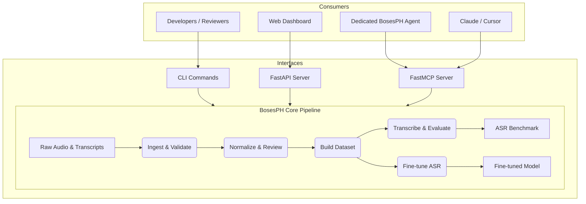

# BosesPH Toolkit

BosesPH Toolkit is a CLI-first, open-source pipeline for turning raw
Philippine-language speech recordings and transcripts into reusable datasets,
ASR benchmarks, and optional fine-tuned speech-recognition models.

The MVP focuses on Kapampangan while keeping the workflow reusable for other
Philippine languages. It is a dataset and model-development toolkit—not only a
transcription application.

## Architecture & Ecosystem

The BosesPH Toolkit provides multiple interfaces to interact with the core speech pipeline, making it accessible to humans, web dashboards, and AI agents.



## Current Status

| Phase | Feature | Status | Interface |
|---|---|---|---|
| **Phase 1** | Schema & Guidelines | ✅ Complete | Docs |
| **Phase 2** | Audio/Transcript Ingestion | ✅ Complete | CLI, API, MCP |
| **Phase 3** | Text Normalization & Review | ✅ Complete | CLI, API, MCP |
| **Phase 4** | Dataset Splits & Statistics | ✅ Complete | CLI, API, MCP |
| **Phase 5** | Baseline Evaluation (WER/CER) | ✅ Complete | CLI, API, MCP |
| **Phase 6** | ASR Fine-tuning (LoRA) | ✅ Complete | CLI, API |
| **Phase 7** | Model Evaluation & Comparison | ✅ Complete | CLI, API |
| **Phase 8** | Web Dashboard & Live Demo | ✅ Complete | Web |
| **Phase 9** | MCP Server & AI Agents | ✅ Complete | MCP, Agent |

## Quick Start

Python 3.10 or newer is required.

```bash
# 1. Clone and set up the environment
git clone <repo-url> && cd bosesph-toolkit
python3 -m venv .venv
source .venv/bin/activate

# 2. Install the toolkit with all optional extras
python -m pip install -e ".[asr,train,api,mcp,dev]"

# 3. Import a PLD Kapampangan session
bosesph import-pld PLD/PAM/0400 --output outputs/dataset

# 4. Normalize transcripts
bosesph normalize-transcripts outputs/dataset

# 5. Review clips interactively
bosesph review outputs/dataset

# 6. Build the dataset with train/val/test splits
bosesph build-dataset outputs/dataset --output outputs/dataset_15spk

# 7. Run baseline ASR transcription
bosesph transcribe outputs/dataset_15spk \
  --model openai/whisper-small --language tl \
  --split test --output outputs/benchmark/baseline_predictions.csv

# 8. Evaluate baseline WER/CER
bosesph evaluate \
  --predictions outputs/benchmark/baseline_predictions.csv \
  --output outputs/benchmark/baseline \
  --model-name "Baseline Whisper Small"

# 9. Fine-tune with LoRA (optional)
bosesph finetune outputs/dataset_15spk \
  --output outputs/model/kapampangan-lora \
  --base-model openai/whisper-small \
  --language tl --use-lora

# 10. Evaluate fine-tuned model
bosesph transcribe outputs/dataset_15spk \
  --model outputs/model/kapampangan-lora/model --language tl \
  --split test --output outputs/benchmark/finetuned_predictions.csv

bosesph evaluate \
  --predictions outputs/benchmark/finetuned_predictions.csv \
  --output outputs/benchmark/finetuned \
  --model-name "BosesPH LoRA Fine-tuned"

# 11. Compare baseline vs fine-tuned
bosesph compare \
  --baseline outputs/benchmark/baseline/results.json \
  --finetuned outputs/benchmark/finetuned/results.json \
  --output outputs/benchmark/comparison.md
```

## Web Dashboard & Live Demo

The web dashboard provides a pipeline overview and live transcription demo.

```bash
# Start the API backend
PYTHONPATH=src bosesph-api
# → http://localhost:8000 (OpenAPI docs at /docs)

# Start the Next.js frontend
cd apps/web && pnpm install && pnpm dev
# → http://localhost:3000
```

### Dashboard Page (`/`)

Shows 7 real-time status cards that poll the API every 10 seconds:

| Card | Source |
|---|---|
| Dataset Clips | `dataset_stats.total_clips` |
| Approved Clips | `dataset_stats.approved_clips` |
| Speakers | `dataset_stats.num_speakers` |
| Total Minutes | `dataset_stats.total_duration_minutes` |
| Baseline WER | `baseline_metrics.wer` |
| Fine-tuned WER | `finetuned_metrics.wer` |
| Model Version | `model_version` |

### Demo Page (`/demo`)

1. Upload a WAV audio file (drag-and-drop or file picker)
2. Select language (Kapampangan or auto-detect)
3. Select model (Whisper Small baseline or BosesPH LoRA fine-tuned)
4. Optionally paste a reference transcript for WER/CER scoring
5. Click **Transcribe** and see the result with metrics

The demo uses the `colab_finetuned_model_tl` model — **Whisper Small** fine-tuned with LoRA on 4,065 Kapampangan clips using `language=tl` (Tagalog proxy).

## FastAPI Backend

```bash
bosesph-api
```

The default workspace is the project root (`.`), the default address is
`http://0.0.0.0:8000`, and OpenAPI documentation is available at `/docs`.

Override settings with environment variables:

| Variable | Default | Description |
|---|---|---|
| `BOSESPH_WORKSPACE` | `.` | Root directory for pipeline I/O |
| `BOSESPH_HOST` | `0.0.0.0` | Bind address |
| `BOSESPH_PORT` | `8000` | Bind port |
| `BOSESPH_MAX_WORKERS` | `2` | Thread pool size for background jobs |

### API Endpoints

| Method | Endpoint | Description |
|---|---|---|
| `GET` | `/project-status` | Dataset stats, metrics, model info |
| `GET` | `/demo/options` | Available languages and models |
| `POST` | `/demo/transcribe` | Submit audio for transcription |
| `GET` | `/jobs/{id}` | Poll a background job |
| `POST` | `/upload-audio` | Upload audio files |
| `POST` | `/upload-transcripts` | Upload transcript CSV |
| `POST` | `/validate-dataset` | Validate dataset metadata |
| `POST` | `/build-dataset` | Build dataset with splits |
| `POST` | `/transcribe` | Transcribe audio or split |
| `POST` | `/evaluate` | Compute WER/CER |
| `POST` | `/train` | Start fine-tuning |
| `GET` | `/download-output` | Download output files |

## MCP Server, Agents & Skills

For detailed instructions on the MCP server, AI agent, and custom skill, see
[docs/MCP_AGENTS.md](docs/MCP_AGENTS.md).

## CLI Reference

### Import & Ingestion

```bash
bosesph import-pld PLD/PAM/0400 --output outputs/dataset [--overwrite]
```

### Metadata Validation

```bash
bosesph validate-metadata sample_data/metadata_template.csv [--format json]
bosesph export-metadata-schema --output docs/metadata.schema.json
```

### Transcript Normalization

```bash
bosesph normalize-transcripts outputs/dataset
```

Updates `metadata.csv` and writes `normalization_report.json`. Exit code `1`
means some transcripts still need human review. Exit code `2` means invalid
input.

### Interactive Review

```bash
bosesph review outputs/dataset
```

Actions: approve (`a`), needs fix (`f`), reject (`r`), skip (`s`), quit (`q`).
Decisions are saved immediately and resumable.

### Dataset Builder

```bash
bosesph build-dataset outputs/dataset --output outputs/dataset_built \
  [--train 0.70 --val 0.15 --test 0.15 --seed 42]
```

### ASR Transcription

```bash
# Single file
bosesph transcribe outputs/dataset_15spk \
  --model openai/whisper-small --language tl

# Entire split
bosesph transcribe outputs/dataset_15spk \
  --model openai/whisper-small --language tl \
  --split test --output outputs/benchmark/predictions.csv [--limit 300]
```

### Evaluation

```bash
bosesph evaluate \
  --predictions outputs/benchmark/predictions.csv \
  --output outputs/benchmark/baseline \
  --model-name "Baseline" --language kapampangan
```

### Fine-tuning

```bash
bosesph finetune outputs/dataset_15spk \
  --output outputs/model/bosesph-kapampangan-v1 \
  --base-model openai/whisper-small \
  --language tl [--use-lora --max-steps 500]
```

### Model Comparison

```bash
bosesph compare \
  --baseline outputs/benchmark/baseline/results.json \
  --finetuned outputs/benchmark/finetuned/results.json \
  --output outputs/benchmark/comparison.md
```

## Repository Structure

```
bosesph-toolkit/
├── src/bosesph/         # Core pipeline: CLI, services, schemas
│   ├── api/             # FastAPI backend
│   └── mcp/             # MCP server (FastMCP)
├── apps/
│   ├── web/             # Next.js 16 dashboard & demo UI
│   └── agent/           # Autonomous BosesPH agent
├── .agents/skills/      # Custom skill for AI agents
├── docs/                # Architecture, formats, guidelines
├── sample_data/         # Small redistributable fixtures
├── scripts/             # Setup, conversion, export utilities
├── outputs/             # Generated datasets, models, reports (not committed)
└── PLD/                 # Raw PLD recording sessions (not committed)
```

## Development

```bash
# Install dev dependencies
python -m pip install -e ".[dev]"

# Lint and format
ruff check .
black --check .

# Run Python tests
pytest

# Run frontend tests
cd apps/web && pnpm test
```

## Project Documents

- [Requirements](Requirements.md) — product behavior, architecture, and
  recommended technology.
- [Tasks](Tasks.md) — phased build plan and implementation status.
- [Contributor Guide](AGENTS.md) — repository and development conventions.
- [Dataset Format](docs/dataset_format.md) — metadata fields and validation
  rules.
- [Transcription Guidelines](docs/transcription_guidelines.md) — Kapampangan
  transcription and review policy.
- [MCP, Agents & Skills](docs/MCP_AGENTS.md) — MCP server setup, AI agent,
  and custom skill documentation.

## Data Responsibility

Do not commit private recordings, personally identifying speaker metadata,
secrets, generated datasets, model weights, or unlicensed material. Only small,
redistributable, or explicitly consented fixtures belong in `sample_data/`.
Every released dataset should document its source, consent, license, intended
use, and known limitations.

## License

Licensed under the [Apache License 2.0](LICENSE).
